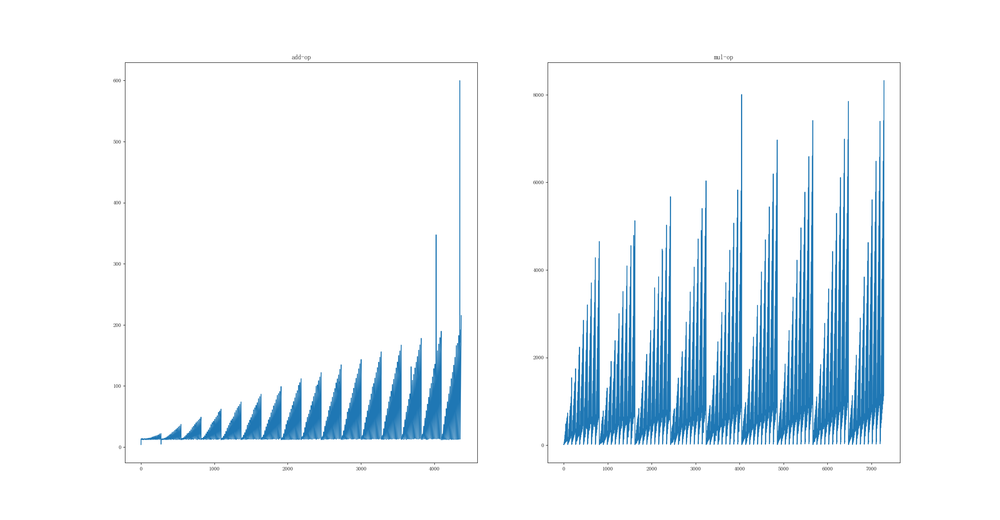
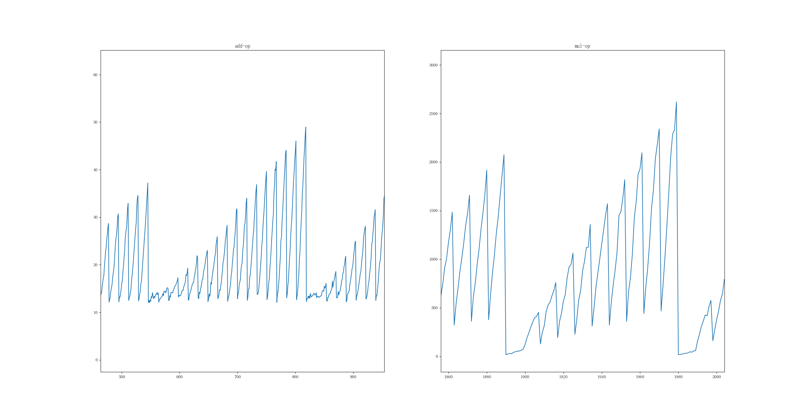

# 基于算子的模型运行时间静态估算

Doing 、to-do and done
> 当前工作：
>
>       针对全连接神经网络的算子，生成相应训练集
> 
>       问题：需要独占服务器，要花时间另外搭环境
>       
> 下一步工作：
> 
>       通过训练集完成预测，并校准修复已知问题
> 已经完成：
>
>       * TensorFlow/Pytorch => ONNX标准化模型
>       * 基于TVM对ONNX模型解析为计算图
>       * 单独执行某个算子
>       * 已经生成add算子的训练集(create_dataset/add_float.txt)
>       * 生成matmul算子的训练集(create_dataset/mul_mat.txt)

模型可训练的依据，可参考文档最后

## 一、背景及意义

暂略

## 二、研究目标
将已知深度学习模型从算子层面解析，结合深度学习的方法，以静态的方式估算模型在具体软硬件环境下的运行时间。

## 三、理论支撑
1. 已知深度学习框架生成的模型，可以结合ONNX/Core ML等标准模型，最终通过TVM解析为计算图。


<p align="center">图片来源于网络</p>

> ONNX：一种针对机器学习所设计的开放式文件格式，用于存储训练好的模型，使得不同的人工智能框架可以采用相同格式存储模型数据并交互
> 
> NNVM: 用于生成计算图。它将不同框架的工作负载表示为标准化计算图，然后将这些高级图转化为执行图
> 
> TVM:  用于映射张量运算。它提供一种独立于硬件的特定域语言（DSL），以简化张量索引层次中的运算符实现。

> 详细可参阅：https://sanallen.gitbooks.io/workdoc/content/shen-du-xue-xi-bian-yi-zhong-jian-jian/shen-du-xue-xi-bian-yi-zhong-jian-jian-zhi-nnvm-4e0029-jie-shao.html

2. 深度学习模型最终可以转化为已知类型算子的操作组合

3. 通过讨论单个算子在不同环境下的运算效率，最终可以静态的分析出任意模型的总运行效率（时间）

## 四、具体实现

1. 将任意深度学习模型解析为算子的“组合图”（以下未特别说明均指代TVM转化后所支持的算子操作）
* 将一般模型转化为 标准化模型（实验采用ONNX）
    * 已完成
* 通过TVM将ONNX解析为计算图，建立存储结构
    * 已完成

2. 实现对于指定类型算子在指定环境下的运算时间估计。结合深度学习的方法，构建 T<sub>op</sub> = F(x<sub>1</sub>,x<sub>2</sub>,...,x<sub>n</sub>,y<sub>1</sub>,y<sub>2</sub>,...,y<sub>n</sub>)，其中x<sub>1</sub> ~ x<sub>n</sub>是算子相关的若干参数，y<sub>1</sub> ~ y<sub>n</sub>是描述软硬件层面（环境状态）相关的若干参数
* 算子层面：
    * 算子规模（为减少状态空间，需限定算子输入/输出规模）：**理论上规模越大，最终模型的描述能力越强**
        * 待估计给定（需结合实际讨论）
    * 算子类别：
        * 线性运算
            * 加法
            * 减法
            * 其它
        * 乘性运算
            * 乘法
            * 激活
        * 非线性运算
            * 卷积
            * 激活
            * 其它
* 软硬件层面考虑范围（采用逐步扩充的方式）：*注：初期假定运算力充足，暂不考虑硬件层面*
    * CPU
    * GPU
    * 内存
    * 其它

> 考虑到算子的多样性和环境的复杂性，算子估算模型将以接口调用的形式进行，通过对外开放接口，使得算法适用性、准确性可不断迭代增强

3. 结合以上工作，模型的运行时间估算问题转化成了针对计算图的路径搜索问题。理论运行时间 T = max{ T<sub>path</sub> }，其中T<sub>path</sub>为单条路径运行的时间

## 五、工作难点及其可能存在的解决方案
1. 单个算子的输入/输出规模导致的状态空间爆炸
	* 考虑适当限定算子的运算规模，这会降低算子对模型的描述能力，我们应该在复杂性和实用性之间取得相对平衡

2. 算子类型多样，有限的时间和成本下枚举所有算子的模型不现实

	* 将算子在指定环境下运算时间的估算，表示为对已知模型的调用。我们对外提供模型标准和调用接口，使得可借助社区等形式的力量对算法描述能力进行后期增强
	* 实验中仅考虑已知几种常用的算子估算模型
	* **注：不同算子的估算模型组成的集合越接近全集，理论上算法的适用性越强**

3. 软硬件层面（系统状态）情况比较复杂，重点考虑如何抽取相关因子，并考虑如何拿到目标条件下的训练数据

4. 在最终的路径搜索中，本质上是一个穷举搜索，暴力计算复杂度为O(n!)
	* 考虑限定模型种类，例如CNN的复杂度明显小于ResNET（计算图更为简单）
	* 结合模型本身特点，做算法层面优化

5. 其它未知

## 六、后期工作计划

整体的工作复杂性比较大，尤其是未知性。计划采用迭代增强的方式进行研究，分别考虑从以下几个角度进行迭代：

* 网络模型类型角度：
    * 全连接神经网络
        * 仅涉及线性和乘性算子
    * 卷积神经网络
        * 引入常见的非线性计算算子
    * 其它网络
        * 引入其它算子，以及计算图的复杂性

* 网络模型规模的角度：（伴随着路径搜索的状态空间爆炸问题）
    * 小规模
    * 中规模
    * 大规模

* 硬件环境的角度：
    * 无限制
    * 仅CPU运算(引入型号)，内存无限制
    * 仅CPU运算（引入型号），存在内存限制
    * 考虑CPU+GPU运算（不限制显存）
    * 硬件环境整体受限

## 七、关键文件说明

## 八、参考资料
> TVM手册：https://support.huaweicloud.com/odevg-A200_3000/odevg-A200_3000.pdf

## 九、附加参考

测试代码：
```python
import matplotlib.pyplot as plt

f=open("add_float.txt","r")

datas1=[]
line = f.readline()
while line is not None and len(line)>0 :
    datas1.append(float(line.split(",")[1]))
    line=f.readline()

f.close()


f=open("mul_mat.txt","r")

datas2=[]
line = f.readline()
while line is not None and len(line)>0 :
    datas2.append(float(line.split(",")[1]))
    line=f.readline()

f.close()


plt.rcParams['font.sans-serif'] = ['FangSong']  # 指定默认字体
plt.rcParams['axes.unicode_minus'] = False  # 解决保存图像时'-'显示为方块的问题
 
plt.figure(1)
add_img = plt.subplot(1, 2, 1)
plt.plot(datas1)
add_img.set_title("add-op")

mul_img = plt.subplot(1, 2, 2)
plt.plot(datas2)
mul_img.set_title("mul-op")

plt.show()
```

